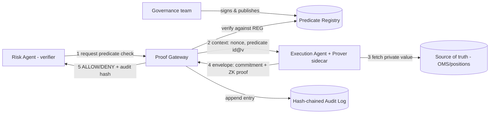
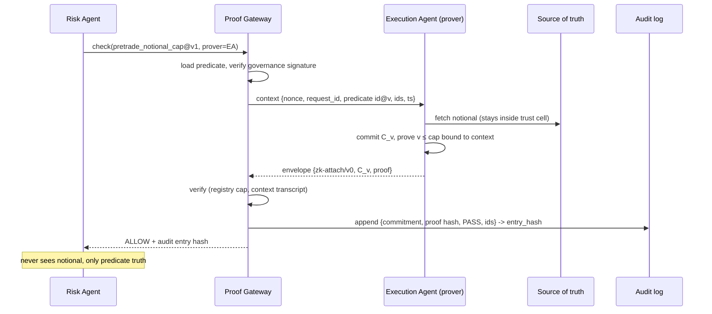

# ZK Proof Gateway, Implementation Architecture & High-Level Design

Reference prototype for *"Zero-Knowledge Data Minimization for Multi-Agent AI Systems"* (IEEE Access draft). This HLD maps 1:1 to paper Section IV (architecture), Section V (case study), and Section VI (feasibility); measured results are in `results/RESULTS.md`.

---

## 1. System overview

**Design goal:** when agent A must establish that agent B's private data satisfies a policy, the wire carries a *predicate proof*, never the data and never a natural-language claim.

```
                       ┌──────────────────────────────┐
                       │   GOVERNANCE / RISK TEAM     │
                       │  (holds registry signing key)│
                       └──────────────┬───────────────┘
                                      │ publishes signed predicates
                                      ▼
┌──────────────┐   1.request   ┌──────────────────┐    ┌───────────────────┐
│  RISK AGENT   │─────────────▶│  PROOF GATEWAY   │───▶│ AUDIT LOG          │
│  (verifier/   │◀─────────────│  - registry      │    │ (append-only,      │
│   relying)    │  6.ALLOW/DENY│  - verifier      │    │  hash-chained)     │
└──────────────┘   +audit hash │  - context/nonce │    └───────────────────┘
                               └───────┬──────────┘
                       2.challenge ctx │ ▲ 5.envelope{commitment, proof}
                                       ▼ │
                              ┌────────────────────┐
                              │  EXECUTION AGENT   │   3.fetch   ┌────────────┐
                              │  prover sidecar    │◀───────────│ SOURCE OF   │
                              │  (ZK engine)       │  4.commit+  │ TRUTH (OMS/ │
                              │  PRIVATE: notional │    prove    │ positions)  │
                              └────────────────────┘             └────────────┘
```

Mermaid component view:



## 2. Components (and where they live in this repo)

| Component | Responsibility | Code |
|---|---|---|
| **Predicate Registry** | Governance-owned catalog of predicate definitions (`range_leq`, params, bit-width, unit), each Schnorr-signed by the governance key. Agents cannot publish; gateway re-verifies signatures on read (defends registry-tamper). | `python/zkgw/gateway.py::PredicateRegistry` |
| **Proof Gateway** | Issues request contexts (fresh nonce, predicate id@version, requester/prover ids, timestamp); verifies envelopes against registry predicates; appends audit entries. Stateless between requests except the audit chain head. | `gateway.py::ProofGateway` |
| **Prover sidecar** | Runs next to the data-holding agent (or the source system, §6). Two interchangeable engines behind one interface: **(E1)** pure-Python Pedersen bit-decomposition with CDS OR-Sigma proofs, Fiat-Shamir (O(n) size, auditable ~300 LoC); **(E2)** Rust dalek **Bulletproofs** (O(log n) size, production path). | `zkgw/rangeproof.py`, `rust/zkrp/` |
| **Proof envelope** | The proposed protocol extension: a `zk-attach/v0` JSON object carried with a tool call / handoff. Contains predicate id@version, engine id, request context, base64 proof. **The private value appears nowhere.** | `gateway.py::make_envelope` |
| **Audit log** | Append-only JSONL, `entry_hash = SHA256(prev_hash || canonical(entry))`. Stores commitment + proof hash + result -> non-repudiable, replayable verification record without storing data. | `gateway.py::AuditLog` |
| **Agents** | `ExecutionAgent` (private `notional_cents`, never exported), `RiskAgent` (relying party; sees only decision + envelope). | `gateway.py` |

## 3. Cryptographic design

**Statement (predicate `range_leq`):** PoK{(v, r) : C_v = v*G + r*H ∧ 0 <= v <= cap}.

Engine E1 construction (fully implemented, `rangeproof.py`):
1. Bit-commit v: `C_i = b_i*G + r_i*H`; the value commitment is defined as `C_v = sum 2^i*C_i` (verifier recomputes, no separate linking proof needed).
2. Each bit proved in {0,1} with a Cramer-Damgard-Schoenmakers OR-composition of two Schnorr proofs (branch 0: `C = r*H`; branch 1: `C - G = r*H`), one **global Fiat-Shamir challenge** split per-bit as `e = e0 + e1`.
3. `v <= cap` via the homomorphic difference: verifier computes `C_d = cap*G - C_v` itself; prover range-proves `d = cap - v` with bit blindings constrained so `sum 2^i*C_{d,i} = C_d` **exactly** (blinding of bit 0 solves the linear constraint).
4. **Context binding:** the Fiat-Shamir transcript absorbs `{request_id, nonce, predicate_id, predicate_version, requester, prover, ts}` before any commitment -> a proof is valid only for the exact request that solicited it (replay/splice across nonces, agents, or predicate versions fails, verified in tests T3/T4).

Engine E2 (Rust) proves `v in [0, 2^n)` with Bulletproofs over ristretto255; `v <= cap` uses the identical two-statement reduction (or one 2-aggregate proof). Context binding via Merlin transcript `append_message("context", ...)`, verified by the cross-context negative test.

**Trust assumptions:** discrete log on secp256k1 / ristretto255; random-oracle model for Fiat-Shamir; `H` derived by hash-to-curve (no known dlog relation to `G`); governance signing key secure; verifier (gateway) honest, the prover is *not* trusted.

## 4. Protocol flow (Section V sequence diagram)



## 5. Proposed protocol extension (`zk-attach/v0`)

No current agent protocol carries a proof slot; this prototype defines one that fits MCP `tools/call` params or an A2A message part without breaking existing schemas. Both bindings are implemented (`agent_server.py` and `go/gatewayservice` each speak both surfaces on the same HTTP endpoint, sharing one verification chain and one audit/orders ledger underneath):

```json
{
  "method": "tools/call",
  "params": {
    "name": "submit_order",
    "arguments": { "order_ref": "ord-9912" },
    "zk_attachment": {
      "schema": "zk-attach/v0",
      "predicate_id": "pretrade_notional_cap",
      "predicate_version": 1,
      "engine": "bulletproofs-ristretto255 | bitor-sigma-secp256k1-py",
      "context": { "request_id": "...", "nonce": "...", "requester": "...", "prover": "...", "ts": 0 },
      "proof_b64": "..."
    }
  }
}
```

The A2A binding carries the identical attachment inside a `Message`'s data part instead of `tools/call` params -- A2A has no native "tool call" concept, so the governed action's name and arguments travel alongside the attachment in the same data part, and the response is a `Task` rather than a JSON-RPC result:

```json
{
  "method": "message/send",
  "params": {
    "message": {
      "role": "user", "kind": "message", "messageId": "m-1",
      "parts": [{
        "kind": "data",
        "data": {
          "skill": "submit_order",
          "arguments": { "order_ref": "ord-9912" },
          "zk_attachment": { "schema": "zk-attach/v0", "...": "..." }
        }
      }]
    }
  }
}
```

Discovery differs too: MCP callers learn the governed predicate from `tools/list`'s `x_zk_required` field; A2A callers learn it from the Agent Card served at `GET /.well-known/agent.json`, in the `submit_order` skill's description. Both callers obtain a request context from the same `zk/context` method before proving, regardless of which surface they then call back on.

Semantics: a gateway/middleware verifying the attachment MAY authorize the call without the sensitive argument ever being present; absence of a required attachment for a registered predicate => deny-by-default.

## 6. Deployment topologies & the source-integrity question

A ZK proof binds the statement to the **committed** value, it cannot, by itself, show the committed value equals the system-of-record value. Two topologies address this (paper Section IV/VII):

- **(A) Source-side prover (recommended):** the prover sidecar is co-located with the source of truth (OMS/position service), which signs `C_v`. The agent merely transports the envelope. Compromise of the LLM agent cannot alter what is proved.
- **(B) Agent-side prover + data attestation:** the source returns `(value, signature over commitment opening)`; the agent proves over the attested commitment. Weaker (agent sees the value) but requires no source-side changes; still removes the value from **inter-agent** traffic, which is this paper's scope.

## 7. Attestation-bound predicate proofs (proposed protocol extension)

**Status: design only — nothing in this section is implemented.** No code in
this repo currently produces, consumes, or verifies an attestation document.
This is a protocol proposal for paper Section IV/VII, at the same
pre-implementation stage §5's `zk-attach/v0` envelope was before P0.

**The gap this closes.** §6 names the source-integrity question and gives
two topologies, but neither says how a remote verifier cryptographically
confirms *which binary* produced the committed value — topology A only
says the prover is co-located with the source. This proposal fuses a
hardware attestation with the predicate proof so that verifying a single
artifact certifies two things jointly: (i) the predicate holds over a
committed value, and (ii) that value was read from the source of truth by a
specific, measured binary running in an attested enclave. Neither half can
be substituted independently of the other. Prior TEE+ZK designs tend to
keep the two layers independent — an attestation carried alongside a proof
rather than fused into one artifact; this proposal binds them by
construction, in both directions, so one cannot be swapped without
invalidating the other.

**Mutual binding.** One-directional binding is insufficient; both of these
are required:

- **Direction A — attestation commits to the proof.** The enclave populates
  the attestation document's `report_data` field with
  `SHA-384(C_v || predicate_id || predicate_version || nonce || action_ref)`.
  This stops a valid attestation from being replayed alongside a different
  commitment, predicate, or request.
- **Direction B — proof commits to the attestation.** Before any commitment
  is generated, the Fiat-Shamir/Merlin transcript absorbs
  `SHA-256(attestation_document)` — extending the same
  `transcript.append_message("context", ...)` call that already does
  context binding (§3 point 4) with a second, attestation-keyed message.
  This stops a valid proof from being presented under a substituted (e.g.
  unattested, or differently-measured) attestation.

Fiat-Shamir binds forward (transcript → proof); `report_data` binds the
enclave's own output backward (nonce/commitment → attestation). The two
directions close the same loop from opposite ends, which is why both are
needed and neither alone suffices.

**Nonce unification — the actual hard part.** The gateway-issued nonce
already binds proof context (§3 point 4). This proposal requires it to be
the *same* value passed to the enclave's attestation call (Nitro:
`NsmProcessAttestation`'s nonce parameter; Confidential Space: the OIDC
token's audience/nonce claim). If the two nonces were allowed to diverge,
an attacker could pair a fresh attestation with a stale-but-still-valid
proof, or the reverse. Making `zk/context`'s single nonce serve both roles,
with identical expiry for both, is the real protocol contribution here —
not the hashing.

**Verification chain** (extends `ProofGateway.verify`; hypothetical
`attestation` field on the envelope), in order:

1. Validate the attestation's certificate chain to the platform root (AWS
   Nitro root / GCP Confidential Space root).
2. Check the measurement (Nitro PCR0-2, or GCP image digest) against a
   governance-registered expected value (new registry predicate type,
   below).
3. Check attestation freshness against the `zk/context` nonce.
4. Recompute `report_data` and compare byte-for-byte.
5. Verify the ZK proof with the attestation hash absorbed into its
   transcript (direction B).
6. Append the attestation digest and measurement to the audit entry
   alongside the existing commitment/proof-hash/result fields — additive
   to the schema; old entries still verify unchanged.

Steps 1-4 authenticate the enclave and bind it to this request; step 5 is
what makes the proof itself worthless without that attestation; step 6
makes the binding replayable from the audit log the same way the rest of
the system already is.

**Registry extension: prover measurement as governance data.** Reuses the
existing signed-predicate machinery (§2) rather than inventing a parallel
trust path: add a `prover_measurement` predicate type carrying the expected
PCR set / image digest, Schnorr-signed by the same governance key that
signs `range_leq` caps, versioned the same way. The registry now states not
just "the cap is $X" but "the only binary permitted to assert this cap is
the one measuring `abc123...`" — policy-controlled prover identity, under
the same signing authority as the business rule it accompanies.

**Honest open problem: enclave I/O.** Nitro Enclaves have no filesystem and
no network — only a vsock channel to the parent EC2 instance. The prover
must reach the source of truth through a vsock proxy on the parent, and the
parent is explicitly untrusted in this threat model (topology A's whole
point is that compromising the agent/parent host shouldn't let it alter
what's proved). This proposal does not yet have a construction for why the
parent can't tamper with what crosses that proxy — it is flagged here as
open rather than hand-waved, since claiming it's solved without one would
be dishonest.

**Cost shape: attestation may dominate, not proving.** A Nitro attestation
document is on the order of 5 KB (COSE_Sign1 plus certificate chain and
PCRs) against the E2 proof's measured 608 B (§9). This inverts which side
of the envelope is expensive, and is worth measuring for real once built —
the interesting result may be that attestation, not proving, becomes the
cost center, which would be notable given this project's original premise
(§9) was that proving was the latency risk.

**Measurement churn vs. predicate versioning.** Rebuilding the prover
changes its PCRs, invalidating a previously-registered
`prover_measurement`. This is a policy question, not a crypto one, and it
mirrors the existing predicate-version story (§2): does a prover upgrade
retroactively invalidate historical audit entries verified under the old
measurement, or does the audit entry pin the measurement-at-time-of-proof
the same way it already pins `predicate_version`? Proposed answer: pin it —
an audit entry's measurement is signed-in-context data like everything else
in the entry, not a live lookup; re-verifying an old entry checks it
against whichever `prover_measurement@version` was current then, exactly as
`range_leq` re-checks against `cap@version` today. No new mechanism is
needed, only extending the existing versioned-registry pattern to a second
predicate type.

**Validation strategy, once this moves past design.** Build and test the
protocol above — nonce unification, transcript absorption, `report_data`
recomputation, the registry extension, the verification chain — against a
local mock attestation document shaped like Nitro's (same COSE structure
and field names, a locally-generated signing cert in place of the AWS
root), so the protocol logic is exercised by real tests without needing an
enclave-capable EC2 host, an AWS/GCP account, or ongoing cloud cost. Point
at real Nitro Enclaves or GCP Confidential Space only once the simulated
version is proven correct — swapping the root-of-trust check and the
attestation-document parser is a small, isolated change if the protocol
underneath is right. (This does not reopen the earlier decision to keep
Nitro/Confidential Space out of the containerization *deployment* scope —
that was about running production infrastructure; this is a research
protocol design that happens to target the same hardware primitive.)

## 8. Multi-hop composition patterns

- **(a) Chained per-hop proofs:** each hop verifies + re-requests; latency adds per hop (measured: +~1.2-2.1 ms verify per hop with E2), max granularity in the audit chain.
- **(b) Aggregated proof at trust boundary:** m range statements in one Bulletproofs aggregate; measured m=16 -> **928 B and 17.4 ms verify vs 10,752 B and ~33.5 ms** for 16 singles (charts in `results/aggregation.png`). Coarser audit granularity, one boundary check. Prover-side aggregation cost grows ~linearly (219 ms at m=16 on this vCPU) -> pre-compute/async.

## 9. Latency budget (measured, single 2.8 GHz Xeon vCPU)

| Pipeline location | Budget | E2 Bulletproofs (32-bit) | Verdict |
|---|---|---|---|
| Real-time tool-call loop (per call) | ~10-50 ms | prove 8.1 ms + verify 1.2 ms | fits; prove can be async/pre-staged |
| Agent handoff / delegation | ~100 ms-1 s | 2x(prove+verify) <= 20 ms | comfortably fits |
| Batch/settlement, audit re-check | seconds+ | verify-only replay 1-2 ms/entry | trivial |
| Same, engine E1 (Python baseline) |, | 749 ms prove / 766 ms verify | reference baseline only |

## 10. Repo map & how to run

```
python/zkgw/{curve,primitives,rangeproof,gateway}.py   # library
python/demo_trading.py      # Section V end-to-end case study
python/tests_soundness.py   # T0-T7 adversarial suite (11 checks)
python/bench.py             # benchmark harness + charts
rust/zkrp/                  # Bulletproofs engine (prove|verify|bench CLI)
results/                    # measured outputs: CSV/JSON/PNG/transcripts
```

Run: `python3 demo_trading.py`, `python3 tests_soundness.py`, `python3 bench.py`; Rust: `cargo build --release && ./target/release/zkrp bench`.

## 11. Known prototype limitations (feed paper Section VII)

- E1 is not constant-time; secp256k1 in pure Python is for auditability, not production. E2 (dalek) is the production path.
- Only `range_leq` is wired end-to-end; set-membership and boolean composition are registry `ptype`s left as stubs by design.
- Gateway is in-process; a networked deployment adds transport auth (mTLS/SPIFFE), orthogonal to the proof layer.
- Metadata leakage (which predicate, when, how often) is *not* hidden, matches paper §VII.
- Proof-of-consistency with the source of truth requires topology A or B above; the ZKP alone does not provide it. §7 proposes closing this gap for topology A via a hardware attestation fused into the proof transcript — design only, not implemented.
