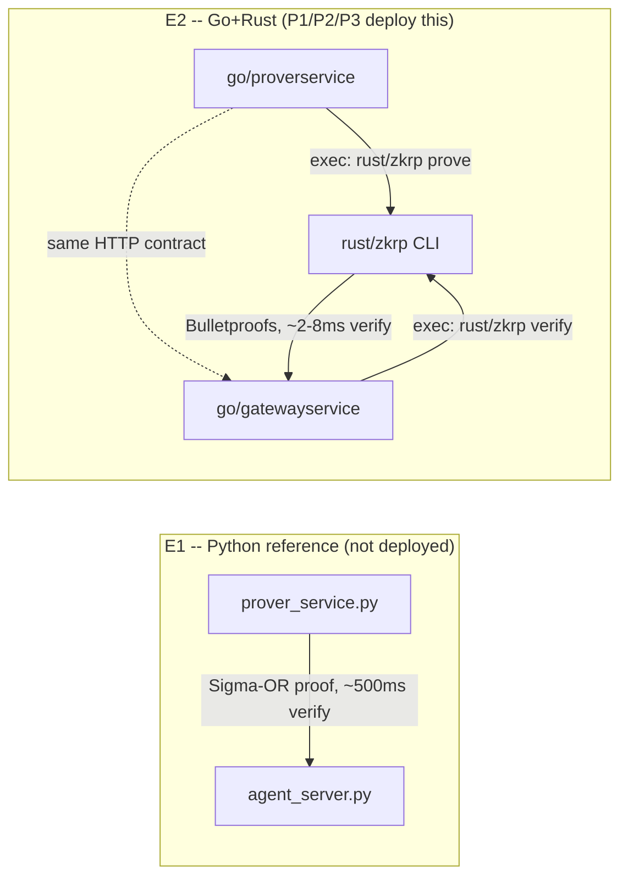
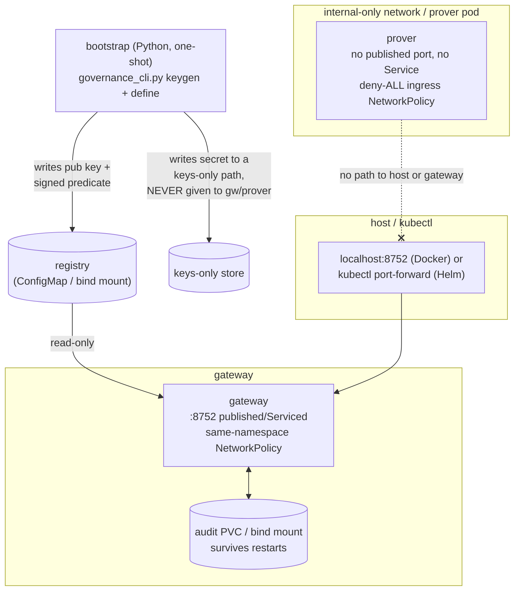

# Implementation HLD — Containerizing the ZK Proof Gateway

Companion to `Spec.md` (the original one-day containerization ask), `HLD.md`
(the paper's architecture), and `IMPLEMENTATION_LLD.md` (file-by-file
detail). This document describes the **as-built** system, not the original
plan — see `Spec.md`'s status addendum for how the two diverge and why.

---

## 1. What actually shipped, in one paragraph

The prover was split out of the in-process gateway into a real HTTP
service (`Spec.md`'s P0), exactly as asked, in Python first. Partway
through, the request shifted from "containerize the Python reference
engine" to "the network-facing services should be fast, not just correct" —
so P0's HTTP contract was re-implemented a second time in Go, proving via
a Rust Bulletproofs engine instead of the Python Sigma-OR engine. That
Go+Rust pair is what P1 (Docker), P2 (Helm), and P3 (Terraform) actually
containerize and deploy. The original Python `agent_server.py` /
`prover_service.py` remain in the repo as the paper's E1 reference
implementation — readable, dependency-light, intentionally not the
production path — but nothing in `docker/`, `helm/`, or `terraform/`
builds or ships them.

Three follow-on passes hardened what P0-P3 first produced: unit tests for
the pieces that previously only had end-to-end coverage, a real `kind`
cluster run that caught two genuine bugs template-rendering alone never
would have, and a security review that caught a real governance-key
exposure and a couple of DoS-shaped gaps. All of this is merged to `main`;
see `CHANGELOG.md` for the PR-by-PR record.

## 2. Two engines, one contract

Both engines expose the identical wire contract: `POST /prove` on the
prover, the same MCP-shaped JSON-RPC surface (`initialize`, `tools/list`,
`zk/context`, `tools/call`, `venue/orders`) plus `GET /healthz` on the
gateway. `python/verify_e2e.py` drives either pairing, or any mix of a
locally-run gateway with a networked prover, via three environment
variables: `ZKGW_PROVER_URL` (hit an external prover instead of proving
in-process), `ZKGW_GATEWAY_CMD` (spawn a different gateway binary), and
`ZKGW_GATEWAY_URL` (attach to an already-running gateway instead of
spawning one — what makes testing the persistent Docker/kind deployments
meaningful rather than re-proving the protocol against a throwaway
instance).

The Go gateway's Schnorr signature verification (`go/internal/predicate`)
replicates `zkgw.primitives.sign`/`sig_verify` exactly — same secp256k1
curve, same challenge hash, same point compression — so predicates signed
by the existing `governance_cli.py` verify unmodified against either
engine. The Go audit log (`go/internal/auditlog`) is byte-compatible with
Python's canonical-JSON hash chain in the same way: confirmed by having
Python's own `AuditLog.verify_chain` re-verify a log file the Go gateway
wrote. Governance predicate signing stays Python in both worlds — it is
never on a request path, and the whole point of hand-rolled Python crypto
there is that a human can read it without trusting a compiled toolchain.

## 3. rust/zkrp: the cap-enforcement fix

The Rust engine existed before this effort but only proved "`v` fits in
`n` bits" — no `cap` parameter anywhere. `cmd_prove`/`cmd_verify` now
implement the actual `range_leq` reduction: `v` and `d = cap - v` are both
range-proved as one 2-aggregate Bulletproof, and the verifier derives
`C_d = cap*B - C_v` itself homomorphically rather than trusting a
prover-supplied commitment — the same construction as the Python E1
engine, just over ristretto255 instead of secp256k1. This was refactored
into pure `prove_range_leq()`/`verify_range_leq()` functions (no
`process::exit`, no printing) specifically so it could be unit-tested
directly; 7 `cargo test` cases cover the honest path and every adversarial
one (tamper, wrong context, lowered cap, over-cap refusal, bit-width
violation, malformed input).

## 4. Deployment topology

Docker Compose and the Helm chart both implement the same shape, adapted
to each platform's idiom:

- **Docker Compose**: prover and gateway share one `internal: true`
  network; the gateway additionally joins a second, non-internal network
  *solely* so its own `ports:` mapping actually works — an
  `internal: true` network silently drops port publishing entirely, which
  is not obvious from the compose file syntax and was found by testing,
  not assumed. Registry and audit are host bind mounts (not anonymous
  volumes) so the demo's grep-for-the-private-value check can run directly
  from the host shell. The governance secret lives in a *third*,
  keys-only bind mount that is mounted into `bootstrap` alone — the
  gateway/prover images never see it.
- **Helm**: prover is a sidecar co-located with a placeholder
  source-of-truth container in one pod (the paper's topology A — the
  prover belongs next to the source of truth, not next to the gateway),
  with no Service of any kind exposing that pod. The gateway is a separate
  ClusterIP Deployment. The audit volume is a `PersistentVolumeClaim`, not
  an `emptyDir` — confirmed by deleting the gateway pod under load and
  checking prior entries survived. Two `NetworkPolicy` objects: deny-*all*
  ingress on the prover (the gateway never calls the prover directly in
  this protocol — the calling *agent* fetches from the prover, then
  separately submits to the gateway — so an allow-list naming the gateway
  would be the wrong policy), and same-namespace-only ingress on the
  gateway as defense-in-depth (the gateway does need to be reachable).
  Confirmed genuinely *enforced*, not just declared: watched the prover
  connection time out with the policy on and succeed with it disabled, on
  a real `kind` cluster.
- **Terraform**: `terraform/gke` and `terraform/eks` are minimal, unapplied
  reference modules — a small cluster plus a `helm_release` of the chart
  above. GKE's node pool requests least-privilege OAuth scopes
  (`devstorage.read_only`, `logging.write`, `monitoring`), not the full
  `cloud-platform` scope. Both modules note that local Terraform state is
  unencrypted and can hold a short-lived cluster auth token in plaintext —
  a remote, encrypted backend is recommended for anything beyond a
  disposable local run.

## 5. Security posture: what's hardened, what's still open

Hardened (see `CHANGELOG.md` for specifics):
- Governance secret key never reaches the gateway/prover's filesystem in
  either Docker or Helm (Helm never referenced it in the first place;
  Docker's bootstrap originally did, fixed in the security review pass).
- Both Go HTTP servers cap request bodies at 1 MiB (`http.MaxBytesReader`)
  — previously unbounded reads were a trivial memory-exhaustion DoS.
- The gateway's in-memory context map is TTL-swept (5 minutes) instead of
  growing for the lifetime of the process.
- Internal subprocess error detail (Rust CLI stdout/exit status) is logged
  server-side only, not echoed into JSON-RPC error responses.
- `automountServiceAccountToken: false` on both Helm Deployments — neither
  pod calls the Kubernetes API.
- The audit log now survives process restarts (the PVC/bind-mount fix) —
  and, separately, `auditlog.New()` no longer truncates an existing file on
  startup, which the PVC fix alone would not have caught, since the
  original Python `AuditLog.__init__` (which the Go code was ported from)
  had the identical bug.

Still open, explicitly deferred rather than silently dropped:
- **No transport authentication at all** between callers and
  gateway/prover — both speak plain HTTP. NetworkPolicy (Helm) and the
  internal-only network (Compose) restrict *who can route to* the pods,
  but nothing authenticates *which* caller is on the other end of an
  allowed connection. mTLS is the planned next step.
- **No HTTP server timeouts or graceful shutdown** on either Go service —
  `http.ListenAndServe` with zero-value `Server` has no
  read/write/idle/header timeouts (slowloris-class DoS is possible), and
  neither service handles SIGTERM to drain in-flight requests before
  exiting. Bundled with the mTLS work, since it's the same "harden the Go
  servers" theme and the same files.
- **Set-membership / boolean-composition predicate types remain stubs.**
  The README already documents this as the main deliberate extension
  point; extending it now, under time pressure, risks the same failure
  mode P3 explicitly avoided by skipping enclave integration — a
  half-finished new cryptographic construction is worse than an honestly
  documented gap. Boolean AND-composition and real multi-predicate
  aggregation (reusing the 2-aggregate construction already built for cap
  enforcement, generalized to more predicates) are in scope as a bounded,
  non-novel extension; full OR-composition/set-membership is not.
- **No observability** (metrics, structured logs beyond the one audit-entry
  log line), **no HA story** (`replicas: 1` hardcoded, no
  PodDisruptionBudget), **no image pinning by digest**, **no
  `readOnlyRootFilesystem`/dropped-capabilities `securityContext`**, and
  **no audit-log rotation or external shipping** — all real
  production-readiness gaps, all lower-urgency than the items above, not
  yet scheduled.

## 6. Verification record

Every claim above has actually been run, not just reasoned about:

| What | How verified |
|---|---|
| Cap enforcement (Rust) | `cargo test` (7 cases) + manual CLI smoke tests |
| Schnorr verify (Go) matches Python | Unit test against a fixture signed by the real `governance_cli.py`, not self-generated |
| Audit hash chain (Go) matches Python | Python's own `AuditLog.verify_chain` re-verifies a Go-written log |
| Docker stack, both containers | `docker compose up --build`, healthy, full 5-scenario verifier against the *persistent* containers, both grep checks clean |
| Audit durability (Docker) | Restarted the gateway container mid-test, entries survived |
| `helm lint` / `helm template` | Both pass, including with real predicate content via `--set-file` |
| `helm install` on a real cluster | `kind` cluster: images built and loaded, chart installed, PVC bound, in-cluster verifier pod (mounting the same audit PVC) — 12/12 at ~2.5ms verify latency |
| NetworkPolicy enforcement | Empirically confirmed on that same `kind` cluster (not assumed) |
| Audit durability (Kubernetes) | Deleted the gateway pod mid-test on that cluster, entries and chain survived across the restart boundary |
| `terraform validate` / `fmt -check` | Both modules, including after the GKE OAuth-scope fix |
| CI | `.github/workflows/ci.yml` runs both engines' full E2E path plus all unit tests on every push |

`terraform apply` and any enclave/Confidential-Space work remain
unattempted — stated here plainly, matching the standard this whole effort
has tried to hold to: state exactly what ran versus what was only
linted/rendered/validated.
