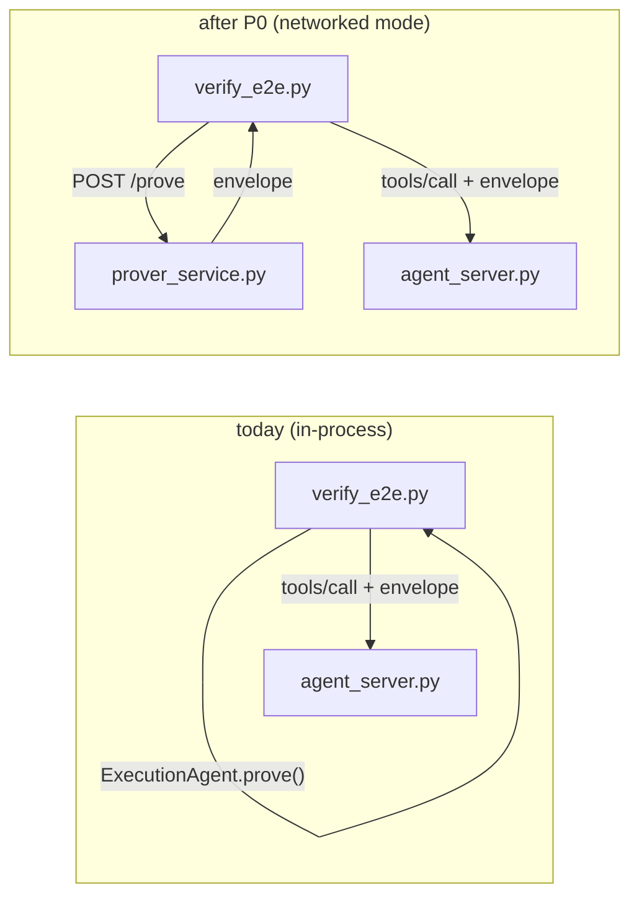
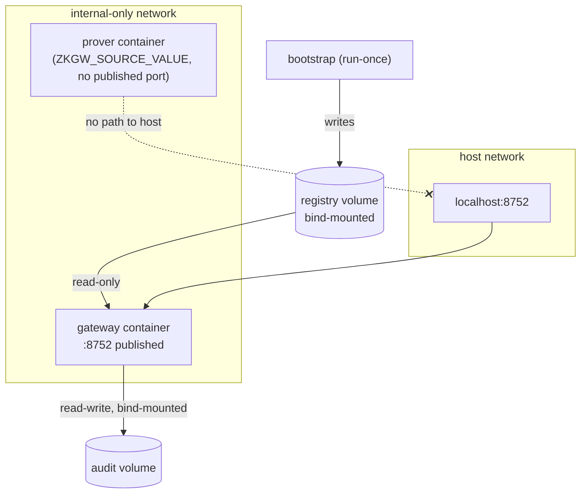
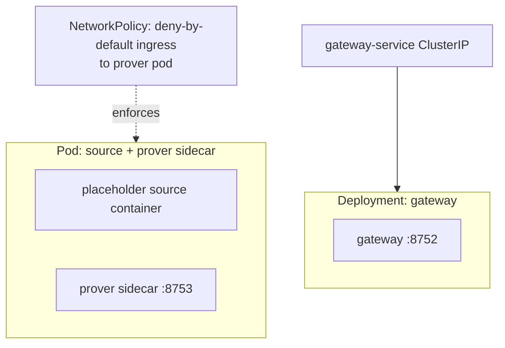

# Implementation HLD — Spec.md: One-Day Containerization

Companion to `Spec.md` (the requirements) and `HLD.md` (the paper's architecture).
This document is the *build* architecture: how the four priorities (P0-P3) land on
top of the current code, in what order, and what changes shape.

Scope is exactly `Spec.md`'s priority order. Stop at whichever P-level the day
runs out at; each P-level is independently shippable and each has its own
acceptance criteria already defined in `Spec.md`.

---

## 1. Where we start vs. where P0 takes us

**Today:** `agent_server.py` is the gateway process. `verify_e2e.py` constructs
`ExecutionAgent` in the same Python process and calls `.prove()` directly —
there is no prover process, no network hop, no trust boundary between prover
and gateway. This is fine for the paper's cryptographic claims (which are about
the proof, not the deployment) but doesn't match the paper's described topology
(prover co-located with the source of truth, gateway elsewhere) and can't be
containerized as two separate trust cells.

**After P0:** a new standalone process, `prover_service.py`, owns the private
value and the `prove_range_leq` call. `verify_e2e.py` gains a second code path
that talks to it over HTTP instead of calling `ExecutionAgent` in-process. Nothing
about the crypto changes — `rangeproof.py`, `gateway.py`'s `make_envelope`, and
`agent_server.py`'s verification chain are untouched. P0 is purely: *move the
existing prove step behind an HTTP boundary.*

This is additive: the in-process path stays as the default (`ZKGW_PROVER_URL`
unset), so nothing that passes today can regress.

## 2. P0 — prover as an HTTP service

`prover_service.py` is a sibling to `agent_server.py`: same style (stdlib
`http.server`, no frameworks), same "no LLM in the trust path" philosophy. It
owns exactly one secret — the value behind `read_source_value()` — and exposes
two endpoints: `/prove` and `/healthz`.

Its only two callers in P0 are: a human running `curl`/manual tests, and
`verify_e2e.py` in networked mode. It does **not** talk to the gateway; it has
no knowledge of `agent_server.py` at all. The caller (agent / test script)
gets an envelope from the prover and separately submits it to the gateway —
this matches the existing protocol shape (`zk/context` → prove → `tools/call`)
and keeps the prover completely decoupled from the verifier, which is the
point of the trust-boundary story.

Security invariant carried forward unchanged: **the service must not produce
a proof for a false statement.** `rangeproof.prove_range_leq` already raises
`ValueError` when the value exceeds the cap (this is what scenario S5 relies
on today); P0 just needs to translate that into HTTP 422 at the boundary,
never a 200 with a bogus envelope.

## 3. P1 — containers

Two images, one compose file, three logical parts:

- **bootstrap** (run-once, gateway image, different entrypoint via override):
  runs `governance_cli.py keygen` + `define`, writing into a registry volume.
  Idempotent — checks whether the predicate file already exists before doing
  anything.
- **prover**: the prover image, configured with the demo's fixed private value
  (`ZKGW_SOURCE_VALUE=735000000`), on the **internal-only** network — no
  published port. This is the load-bearing demo point: the value never leaves
  its trust cell, and there is no route from the host (or the gateway) to
  fetch it except through the proof it produces.
- **gateway**: the gateway image, publishes 8752, mounts the registry
  read-only and an audit volume read-write.

Both the registry and audit volumes are **bind mounts to host directories**
(not anonymous Docker volumes) — required so the acceptance check "grep the
gateway logs and audit volume for `735000000`" can actually be run from the
host shell, and so the demo can show the predicate file's contents without
`docker cp`.

Two code fixes are required for this topology to work at all, not called out
explicitly in `Spec.md` but necessary given how the current servers bind:

- `agent_server.py` and `prover_service.py` must bind `0.0.0.0`, not
  `127.0.0.1` — otherwise the published port and inter-container calls are
  both dead on arrival.
- `verify_e2e.py`, to genuinely exercise the *containerized* stack (not just
  re-prove the P0 claim against a bare `prover_service.py`), needs a way to
  attach to the already-running gateway container instead of spawning its own
  throwaway `agent_server.py` on the same port. See LLD §2.4 for the proposed
  `ZKGW_GATEWAY_URL` extension — this is inferred, not in `Spec.md`'s text,
  flagged as a judgment call.

## 4. P2 — Helm chart

Same three trust cells, expressed as a chart:

- Prover as a **sidecar in the gateway's own pod is wrong** — re-read the
  paper's topology: the prover must be co-located with the *source of truth*,
  not with the gateway (the gateway is the verifier, arm's-length by design).
  `Spec.md` says "sidecar... in the same pod as a placeholder source
  container" — i.e., prover + placeholder-source share a pod; gateway is a
  separate Deployment entirely. This is the stronger story and the one that
  matches §6 of `HLD.md` (topology A: source-side prover).
- `NetworkPolicy` is the artifact that actually enforces "prover has no path
  except through its own proof": deny-by-default ingress to the
  prover/source pod, allow only from nothing external — it doesn't even need
  to allow the gateway, since the gateway never calls the prover directly in
  this protocol (the *agent* calls the prover, then separately calls the
  gateway). Re-reading `Spec.md`'s networkpolicy.yaml line: "allow only from
  the gateway pod selector" — reconcile this against the actual call graph
  before implementing; see LLD §3.3 for the resolution.

## 5. P3 — Terraform (stretch)

Reference-only modules (`terraform/gke/`, `terraform/eks/`) that stand up a
small cluster and `helm install` the P2 chart. Explicitly unapplied unless
actually run — `terraform validate` + `terraform fmt -check` are the bar, not
a live apply. Skip without guilt if P0-P2 consume the day, per `Spec.md`.

## 6. What must not regress, end to end

Carried through every P-level unchanged:

- Prover refuses to prove a false statement (`ValueError` in-process → HTTP
  422 networked → same property, different transport).
- Context binding (`action_ref` etc.) stays in the Fiat-Shamir transcript;
  P0-P2 never touch `rangeproof.py`.
- Gateway is deny-by-default; P0-P2 don't add any alternate path to
  `submit_order`.
- Audit chain still hash-verifies (`AuditLog.verify_chain`).
- `tests_soundness.py` (11/11) and the existing in-process `verify_e2e.py`
  (12/12) are pinned as regression gates, not just one-time acceptance checks
  — the new CI workflow runs both on every push.

## 7. Build order for the day

1. P0: `prover_service.py` + `verify_e2e.py` networked mode + the two bind-host
   fixes. Verify both modes print 12/12 before moving on.
2. P1: `requirements.txt`, both Dockerfiles, compose, docker README, root
   README edits, `.gitignore`. Verify the full stack comes up and the grep
   check is clean before moving on.
3. CI workflow (cheap, do this alongside P1, not last — a green badge only
   means something if it was there before the PR closes).
4. P2: Helm chart. `helm lint` + `helm template` are the floor; cluster
   deploy is a bonus, state clearly which one happened.
5. P3: only if time remains.
